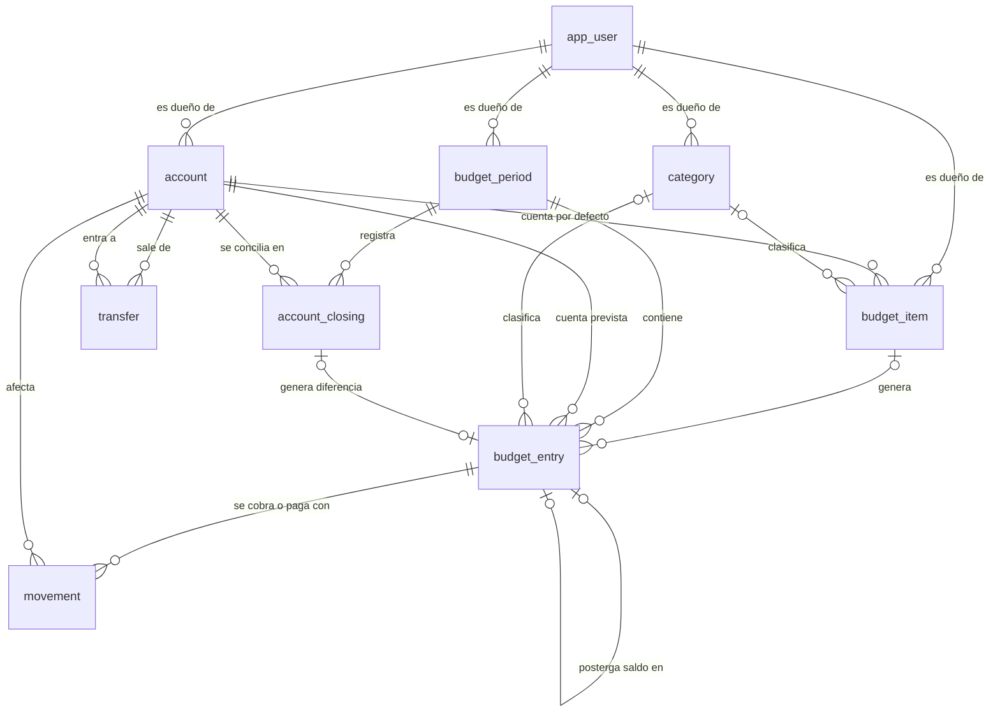

# Modelo de datos

Esquema relacional para MySQL 8, pensado para migrar a PostgreSQL sin rediseñar. Este documento describe lo que garantiza la base; las reglas que mantienen la coherencia entre tablas están en `reglas-de-negocio.md`.

## Convenciones

- Tablas y columnas en inglés, en `snake_case` y en singular.
- No se usan palabras reservadas de MySQL ni de PostgreSQL: por eso `app_user` (no `user`), `movement` (no `transaction`), `budget_period` y `period_month` (no `period` ni `year_month`, reservada en MySQL) y `movement_date` (no `date`).
- Clave primaria `id BIGINT` autoincremental en todas las tablas.
- **Todas las tablas de datos tienen `user_id`**, aunque se pueda llegar al usuario por otra relación. Así cada consulta filtra por usuario de forma directa.
- Enumeraciones como `VARCHAR` con `CHECK`, nunca con el tipo `ENUM` de MySQL. Los valores son los del glosario.
- Montos: `DECIMAL(19,2)`. Fechas de negocio: `DATE`. Períodos: `CHAR(7)` con formato `YYYY-MM`, que se ordena bien como texto.
- Fechas técnicas (`created_at`, `updated_at`, `closed_at`, `consolidated_at`): `DATETIME(6)` en UTC.
- Booleanos: `BOOLEAN`.
- Claves foráneas con `ON DELETE RESTRICT`. No hay borrados en cascada: toda eliminación pasa por las reglas del servicio.
- Juego de caracteres `utf8mb4` con colación `utf8mb4_0900_as_ci`, que compara sin distinguir mayúsculas pero **sí acentos** ("Año" y "Ano" son nombres distintos; "Año" y "AÑO", el mismo). Los nombres únicos por usuario aprovechan eso. Cada `CREATE TABLE` la declara, sin depender de la colación por defecto de la base.
- Migraciones Flyway en `smartcoin-backend/src/main/resources/db/migration/mysql/`. Al migrar a PostgreSQL se agrega `db/migration/postgresql/` con el esquema equivalente.
- Todas las tablas llevan `created_at` y `updated_at` (`account_closing` solo `created_at`, porque no se modifica). En las tablas de abajo no se repiten.

## Diagrama

## Tablas

### app_user

| Columna | Tipo | Nulo | Regla |
|---|---|---|---|
| `id` | BIGINT | no | PK |
| `email` | VARCHAR(254) | no | Único. Se guarda en minúsculas. Es el nombre de usuario. |
| `password_hash` | VARCHAR(100) | no | Hash BCrypt. |
| `must_change_password` | BOOLEAN | no | `true` al crear el usuario y al restablecer la contraseña. |
| `credentials_version` | INT | no | Arranca en 0. Se incrementa al cambiar o restablecer la contraseña; los tokens con otra versión se rechazan. |
| `start_period` | CHAR(7) | no | Período inicial (`YYYY-MM`). No existen períodos anteriores. |
| `enabled` | BOOLEAN | no | Por defecto `true`. |

Restricciones: `UNIQUE (email)`.

### account

| Columna | Tipo | Nulo | Regla |
|---|---|---|---|
| `id` | BIGINT | no | PK |
| `user_id` | BIGINT | no | FK `app_user` |
| `name` | VARCHAR(100) | no | Único por usuario. |
| `type` | VARCHAR(20) | no | `BANK`, `DIGITAL_WALLET`, `CASH` |
| `currency` | CHAR(3) | no | `ARS`, `USD` |
| `opening_date` | DATE | no | Desde cuándo se lleva la cuenta. |
| `initial_balance` | DECIMAL(19,2) | no | Saldo al comienzo de `opening_date`. Puede ser negativo. |

Restricciones: `UNIQUE (user_id, name)`; `CHECK` de `type` y `currency`.

### category

| Columna | Tipo | Nulo | Regla |
|---|---|---|---|
| `id` | BIGINT | no | PK |
| `user_id` | BIGINT | no | FK `app_user` |
| `name` | VARCHAR(60) | no | Único por usuario. |

Restricciones: `UNIQUE (user_id, name)`.

### budget_item (Concepto)

| Columna | Tipo | Nulo | Regla |
|---|---|---|---|
| `id` | BIGINT | no | PK |
| `user_id` | BIGINT | no | FK `app_user` |
| `name` | VARCHAR(100) | no | |
| `kind` | VARCHAR(10) | no | `INCOME`, `EXPENSE`. No editable. |
| `category_id` | BIGINT | sí | FK `category` |
| `default_account_id` | BIGINT | no | FK `account`. La moneda del Concepto es la de esta cuenta. |
| `periodicity` | VARCHAR(12) | no | `MONTHLY`, `BIMONTHLY`, `QUARTERLY`, `SEMIANNUAL`, `ANNUAL`. No editable. |
| `due_day` | SMALLINT | no | 1 a 31. |
| `due_month_offset` | SMALLINT | no | 0 o −1. |
| `start_period` | CHAR(7) | no | Primer período con partida. No editable. |
| `end_period` | CHAR(7) | sí | Último período posible. Null = sin fin. En cuotas se calcula; en una baja se fija. |
| `installments_total` | SMALLINT | sí | Total de cuotas (≥ 1; la API admite hasta 360, D-25). Null = no es en cuotas. No editable. |
| `first_installment_number` | SMALLINT | sí | Cuota que corresponde a `start_period`, entre 1 y `installments_total`. No editable. |
| `estimation_rule` | VARCHAR(20) | no | `LAST_VALUE`, `AVERAGE_LAST_3` |
| `current_amount` | DECIMAL(19,2) | no | Monto vigente, ≥ 0. |
| `generated_until` | CHAR(7) | sí | Último período ya procesado por la generación. Null = todavía no generó. |

Restricciones:
- `CHECK (due_day BETWEEN 1 AND 31)`, `CHECK (due_month_offset IN (0, -1))`, `CHECK (current_amount >= 0)`.
- `CHECK (end_period IS NULL OR end_period >= start_period)`.
- `installments_total` y `first_installment_number` son ambos nulos o ambos no nulos, con `1 <= first_installment_number <= installments_total`.

### budget_period (Período)

| Columna | Tipo | Nulo | Regla |
|---|---|---|---|
| `id` | BIGINT | no | PK |
| `user_id` | BIGINT | no | FK `app_user` |
| `period_month` | CHAR(7) | no | `YYYY-MM` |
| `status` | VARCHAR(10) | no | `OPEN`, `CLOSED` |
| `closed_at` | DATETIME(6) | sí | Obligatorio si está cerrado. |

Restricciones: `UNIQUE (user_id, period_month)`; `CHECK` de `status`; `closed_at` nulo si y solo si `status = 'OPEN'`.

### budget_entry (Partida)

| Columna | Tipo | Nulo | Regla |
|---|---|---|---|
| `id` | BIGINT | no | PK |
| `user_id` | BIGINT | no | FK `app_user` |
| `period_id` | BIGINT | no | FK `budget_period` |
| `budget_item_id` | BIGINT | sí | FK `budget_item`. Obligatorio si `origin = 'RECURRING'`; nulo en los demás orígenes. |
| `origin` | VARCHAR(20) | no | `RECURRING`, `ONE_OFF`, `CARRIED_OVER`, `CLOSING_DIFFERENCE` |
| `name` | VARCHAR(100) | sí | Obligatorio si no hay Concepto. Las recurrentes muestran el nombre del Concepto. |
| `kind` | VARCHAR(10) | no | `INCOME`, `EXPENSE`. En las recurrentes, copia del Concepto. |
| `category_id` | BIGINT | sí | FK `category`. Solo en partidas sin Concepto; las recurrentes usan la del Concepto. |
| `account_id` | BIGINT | no | FK `account`. Cuenta prevista; define la moneda de la partida. |
| `due_date` | DATE | no | Vencimiento. |
| `budgeted_amount` | DECIMAL(19,2) | no | ≥ 0. |
| `is_manual` | BOOLEAN | no | Por defecto `false`. `true` si el usuario editó el monto de una partida recurrente. |
| `status` | VARCHAR(15) | no | `PENDING`, `CONSOLIDATED` |
| `consolidated_amount` | DECIMAL(19,2) | sí | Suma de los movimientos al consolidar. |
| `consolidated_at` | DATETIME(6) | sí | |
| `closing_resolution` | VARCHAR(15) | sí | `CARRY_OVER`, `CLOSE_AS_IS`. Solo si se consolidó durante el cierre del mes. |
| `installment_number` | SMALLINT | sí | Solo en partidas de Conceptos en cuotas. |
| `source_entry_id` | BIGINT | sí | FK `budget_entry`. En `CARRIED_OVER`: partida cuyo saldo se postergó. |
| `source_closing_id` | BIGINT | sí | FK `account_closing`. En `CLOSING_DIFFERENCE`: cierre que la originó. |

Restricciones:
- `UNIQUE (budget_item_id, period_id)`: como máximo una partida por Concepto y período. Los nulos no colisionan.
- `CHECK ((origin = 'RECURRING') = (budget_item_id IS NOT NULL))`.
- `CHECK (budget_item_id IS NOT NULL OR name IS NOT NULL)`.
- `CHECK (budgeted_amount >= 0)`.
- `consolidated_amount` y `consolidated_at` no nulos si y solo si `status = 'CONSOLIDATED'`.
- `closing_resolution` solo puede tener valor si `status = 'CONSOLIDATED'`.

### movement (Movimiento)

| Columna | Tipo | Nulo | Regla |
|---|---|---|---|
| `id` | BIGINT | no | PK |
| `user_id` | BIGINT | no | FK `app_user` |
| `entry_id` | BIGINT | no | FK `budget_entry` |
| `account_id` | BIGINT | no | FK `account`. Misma moneda que la partida. |
| `movement_date` | DATE | no | |
| `amount` | DECIMAL(19,2) | no | > 0. Si suma o resta en la cuenta lo define el tipo de la partida. |
| `note` | VARCHAR(200) | sí | |

Restricciones: `CHECK (amount > 0)`.

### transfer (Transferencia)

| Columna | Tipo | Nulo | Regla |
|---|---|---|---|
| `id` | BIGINT | no | PK |
| `user_id` | BIGINT | no | FK `app_user` |
| `source_account_id` | BIGINT | no | FK `account` |
| `target_account_id` | BIGINT | no | FK `account` |
| `transfer_date` | DATE | no | |
| `source_amount` | DECIMAL(19,2) | no | > 0, en la moneda de la cuenta de origen. |
| `target_amount` | DECIMAL(19,2) | no | > 0, en la moneda de la cuenta de destino. Igual a `source_amount` si las monedas coinciden. |
| `note` | VARCHAR(200) | sí | |

Restricciones: `CHECK (source_account_id <> target_account_id)`, `CHECK (source_amount > 0 AND target_amount > 0)`.

### account_closing (Cierre de cuenta)

| Columna | Tipo | Nulo | Regla |
|---|---|---|---|
| `id` | BIGINT | no | PK |
| `user_id` | BIGINT | no | FK `app_user` |
| `period_id` | BIGINT | no | FK `budget_period` |
| `account_id` | BIGINT | no | FK `account` |
| `computed_balance` | DECIMAL(19,2) | no | Saldo calculado al último día del período. |
| `real_balance` | DECIMAL(19,2) | no | Saldo informado por el usuario. |
| `difference` | DECIMAL(19,2) | no | `real_balance − computed_balance`. Se guarda como registro histórico. |

Restricciones: `UNIQUE (period_id, account_id)`.

## Índices

Además de los que crean las claves primarias, únicas y foráneas:

| Tabla | Índice | Para qué |
|---|---|---|
| `budget_entry` | `(user_id, period_id)` | Vista del mes. |
| `budget_entry` | `(budget_item_id, status, period_id)` | Base de estimación y propagación. |
| `budget_entry` | `(user_id, status, due_date)` | Flujo de caja y proyección. |
| `movement` | `(account_id, movement_date)` | Saldos por fecha. |
| `movement` | `(entry_id)` | Monto real de la partida. |
| `transfer` | `(source_account_id, transfer_date)`, `(target_account_id, transfer_date)` | Saldos por fecha. |

## Valores derivados (no se guardan)

| Valor | Cálculo |
|---|---|
| Monto real de una partida | Suma de `movement.amount` de la partida. |
| Estado mostrado | `CONSOLIDATED` si `status = 'CONSOLIDATED'`; si no, `PARTIAL` si tiene movimientos y `ESTIMATED` si no tiene. |
| Pendiente | 0 si está consolidada; si no, `max(budgeted_amount − real, 0)`. |
| Estimado | `consolidated_amount` si está consolidada; si no, real + pendiente. |
| Moneda de una partida | La de su `account_id`. |
| Total de cuotas de una partida | `installments_total` de su Concepto. |
| Saldo de una cuenta a una fecha | RN-35. |
| Tipo de cambio de una transferencia | Monto en ARS dividido por monto en USD (RN-37). |

## Mapeo en Java

| Tipo de la base | Tipo en Java |
|---|---|
| `BIGINT` | `Long` |
| `INT` | `int` |
| `SMALLINT` | `Integer`, con `@JdbcTypeCode(SqlTypes.SMALLINT)`: sin eso Hibernate espera `INTEGER` y `validate` falla |
| `VARCHAR` | `String` |
| `CHAR(3)` de moneda | `Currency` (enum) con `@JdbcTypeCode(SqlTypes.CHAR)`: sin eso Hibernate espera `VARCHAR` y `validate` falla |
| `DECIMAL(19,2)` | `BigDecimal` |
| `DATE` | `LocalDate` |
| `CHAR(7)` de período | `YearMonth`, con un `AttributeConverter` a `String` `YYYY-MM` (con el convertidor `autoApply`, `validate` acepta `CHAR(7)` sin anotaciones extra) |
| `DATETIME(6)` | `Instant` |
| Enumeraciones | `enum` de Java con `@Enumerated(EnumType.STRING)` (`validate` los acepta sobre `VARCHAR` sin anotaciones extra) |
| `BOOLEAN` | `boolean` |
